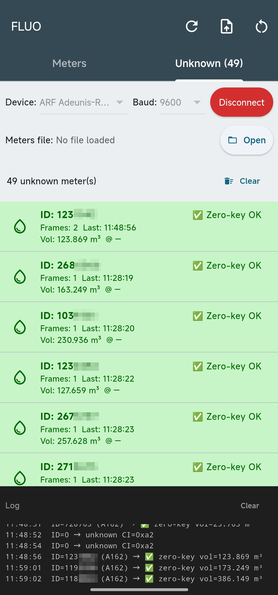
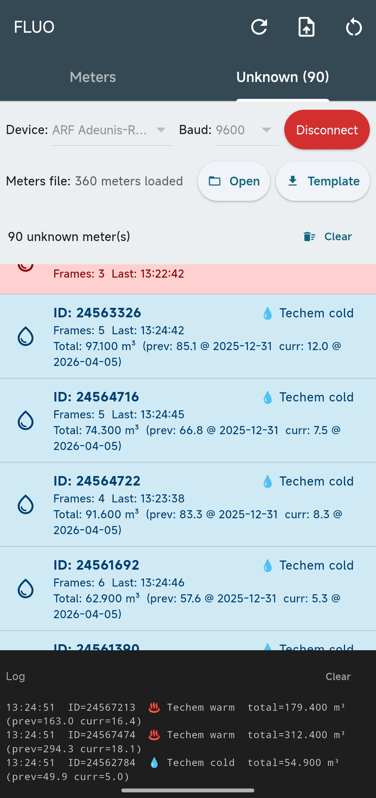
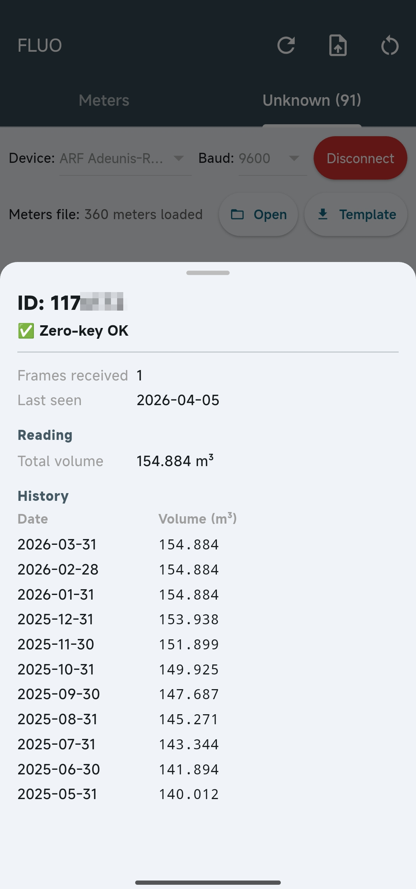

# FLUO – W-MBus Water Meter Reader

Android application for reading data from **Apator 162** water meters and **Techem** heat cost allocators via the **Wireless M-Bus (EN 13757)** protocol.

## Description

FLUO connects to a USB receiver (e.g. Adeunis-RF) via a serial OTG port, receives W-MBus frames, and decodes them in real time. Supported devices:

- **Apator 162** (CI=0x7A, TPL-direct, AES-128-CBC, zero key)
- **Apator with ELL** (CI=0x8C+0x7A, Extended Link Layer, AES-128-CBC, keys loaded from CSV)
- **Techem MK Radio 3** (CI=0xA2, water meter, unencrypted)
- **Techem FHKV Data III** (CI=0xA0, heat cost allocator, unencrypted)

Decoded data includes: current volume (m³), monthly history, and alarms (leak, magnetic field, low battery, etc.).

## Features

- Real-time frame reception via USB OTG serial adapter
- AES key import from CSV file (format: `Radio number;W-MBus key`)
- List of meters with last received readings
- CSV export of readings
- Multi-meter support

## Requirements

- Android 6.0+ with USB OTG support
- W-MBus receiver (e.g. Adeunis-RF, iM871A)
- Flutter 3.x

## Build

```bash
flutter pub get
flutter build apk
```

## License

This project is licensed under the **GNU Affero General Public License v3.0 (AGPL-3.0)**.

Anyone who uses this software (including as a network service) is required to release the complete source code under the same terms. See the [LICENSE](LICENSE) file for details.


## Screenshots

<br>
<br>



